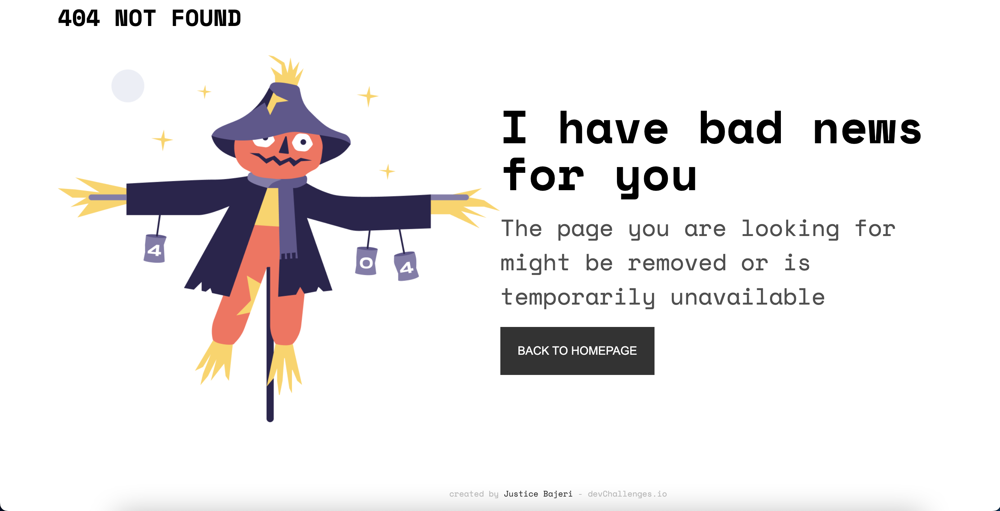

<!-- Please update value in the {}  -->

<h1 align="center">devChallenge 404 Page</h1>

<div align="center">
   Solution for a challenge from  <a href="http://devchallenges.io" target="_blank">Devchallenges.io</a>.
</div>

<div align="center">
  <h3>
    <a href="https://starngeal404dev.netlify.app">
      Demo
    </a>
    <span> | </span>
    <a href="https://github.com/Strangeal/devchallenge-404-page">
      Solution
    </a>
    <span> | </span>
    <a href="https://devchallenges.io/challenges/wBunSb7FPrIepJZAg0sY">
      Challenge
    </a>
  </h3>
</div>

<!-- TABLE OF CONTENTS -->

## Table of Contents

- [Overview](#overview)
  - [Built With](#built-with)
- [Features](#features)
- [Contact](#contact)
- [Acknowledgements](#acknowledgements)

<!-- OVERVIEW -->

## Overview



This is a simple project where i created a beautiful responsive 404 page as my first challenge on (https://devchallenges.io/). I found it fun building this project and one reason why i build this project was to let developers know the importance of adding 404 pages to apps and websites we create for our clients. From my point of veiw i think adding 404 page is important to help users get back to the main or home page of our apps/ website incase they enter an invalid url path and also promotes good user esperience.


### Built With

<!-- This section should list any major frameworks that you built your project using. Here are a few examples.-->

- [React](https://reactjs.org/)
- CSS

## Features

<!-- List the features of your application or follow the template. Don't share the figma file here :) -->

This application/site was created as a submission to a [DevChallenges](https://devchallenges.io/challenges) challenge. The [challenge](https://devchallenges.io/challenges/wBunSb7FPrIepJZAg0sY) was to build an application to complete the given user stories.


## Acknowledgements

<!-- This section should list any articles or add-ons/plugins that helps you to complete the project. This is optional but it will help you in the future. For exmpale -->

## Get Started

To get the content of this project locally you need to run the following commands in your terminal.

### Prerequisites
- IDE(code editor) like: **Vscode**, **Sublime**, etc. 
- [Git](https://www.linode.com/docs/guides/how-to-install-git-on-linux-mac-and-windows/)

### Setup
1. Download the **Zip** file or clone the repo with:
```bash
git clone git@github.com:Strangeal/devchallenge-404-page.git
```
3. To access cloned directory run:
```bash
cd devchallenge-404-page
```
3. Open it with the live server

### Install
> To install project's dependencies run:
```bash
npm install
```

## Contact

- GitHub [@strangeal](https://{github.com/strangeal})
- Twitter [@Str_angeal](https://{twitter.com/Str_angeal})
